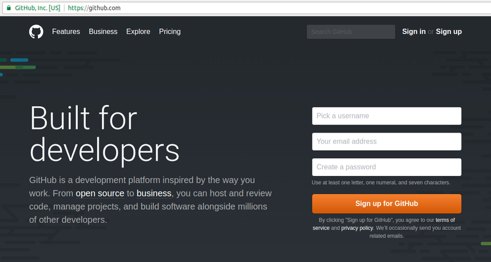
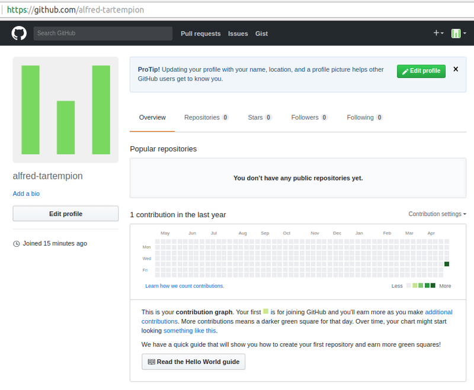
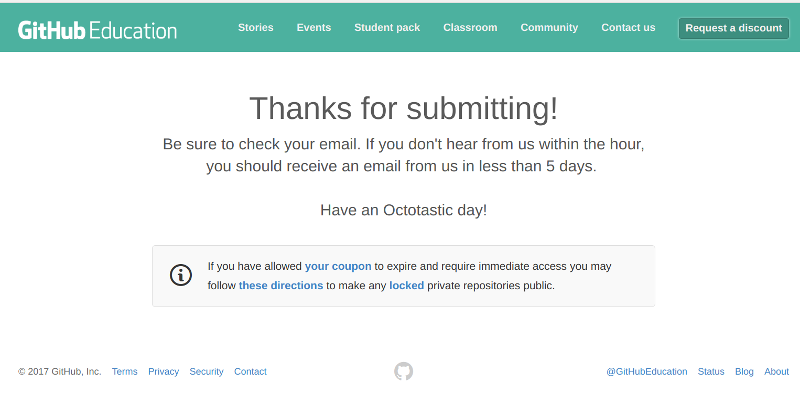

#  Introduction aux IHM en Java 

### IUT d’Aix-Marseille – Département Informatique Aix-en-Provence

* **Cours:** [M2105](http://cache.media.enseignementsup-recherche.gouv.fr/file/25/09/7/PPN_INFORMATIQUE_256097.pdf)
* **Responsable:** [Sébastien NEDJAR](mailto:sebastien.nedjar@univ-amu.fr)
* **Enseignants:** [Sébastien NEDJAR](mailto:sebastien.nedjar@univ-amu.fr), [Cyril Pain-Barre](mailto:cyril.pain-barre@univ-amu.fr)
* **Besoin d'aide ?**
    * La page [Piazza de ce cours](piazza.com/univ-amu.fr/spring2017/m2105/home).
    * Consulter et/ou créér des [issues](https://github.com/IUTInfoAix-M2105/tp1/issues).
    * [Email](mailto:sebastien.nedjar@univ-amu.fr) pour une question d'ordre privée, ou pour convenir d'un rendez-vous physique.

## TP 1 : Découverte de l'environnement de travail, des outils et premiers programmes en Java [](https://travis-ci.org/IUTInfoAix-M2105/tp1)

L'objectif premier de ce TP est de vous familiariser avec tous les nouveaux outils qui seront mis en oeuvre pendant ce cours. En plus de la réalisation d'IHM, ces TP seront la première occasion de se confronter à la gestion de version, au test unitaire et à des outils de gestion de cycle de vie logiciel comme Maven.

### Préparation de l'environnement

Comme vous allez le découvrir, pour conserver vos réalisations et permettre à votre enseignant de suivre votre avancement vous allez apprendre versionner votre travail sur [github](https://github.com/). Pendant ce module, vous allez principalement écrire du code pour vous-même. Comme vous le verrez plus tard ça sera principalement sur les projets à plusieurs que [Git](https://git-scm.com/) offrira sa tout son potentiel.

#### Création d'un compte Github

Rendez-vous sur la page d'accueil de [github](https://github.com/) :



Dans le coin supérieur droit cliquer sur "Sign Up". Dans la page qui apparait, inscrivez votre nom d'utilisateur (il doit être composé de votre prénom et de votre nom spéparé par le caractere '-'). 
Dans le champs "Email Adress" mettre votre adresse universitaire (important pour bénéficier des avantages liés à votre statut d'étudiant). 


Une fois le mot de passe renseigné cliquer sur le bouton "Create Account". Sur l'écran suivant, vous n'avez rien à changer et pouvez directement cliquer sur "Continue".


Le troisième et dernier écran d'enregistrement vous demande des informations sur votre profil. Indiquer principalement que vous êtes un étudiant et que vous comptez utiliser github pour des projets étudiants.


Une fois ces informations renseignées vous pouvez cliquer sur "Submit" pour définitivement créer votre compte.


Ne pas oublier de valider votre adresse email en allant cliquer sur le lien reçu dans l'ENT.

#### Paramétrage de votre compte Github
Maintenant que votre compte est créé, il faut personnaliser votre profil. Github, en plus de vous fournir un moyen simple 
et efficace de conserver votre code en ligne, est aussi un réseau social de développeur. Pour que votre profil puisse 
être valorisé un jour dans votre carrière pro, vous devez correctement renseigner vos informations (de manière annexe, 
ça facilitera la vie de vos enseignants quand ils essayent de savoir qui contribue vraiment au projet tutoré).

Pour ce faire, cliquer en haut à droite de la fenêtre sur l'icone qui représente votre avatar par défaut et aller sur "Your profile"  :


Vous arrivez sur votre profil public (ce qui est visible quand on cherche votre nom) :



Cliquer sur le bouton "Edit profile" pour arriver sur le formulaire suivant :


Comme dans l'image précédente, renseignez correctement votre nom, prénom, votre localisation et éventuellement votre photo.

#### Demande du "Student Pack"
Pour terminer la configuration de votre compte, il vous faut demander la remise académique vous permettant de bénéficier 
de dépôts privés et de nombreux autres avantages. Pour ce faire, il faut vous rendre sur la page suivante : https://education.github.com/pack


Cliquer sur le bouton "Get your pack" et certifiez que vous êtes bien un étudiant de plus de 13 ans : 


Vérifiez les informations vous concernants (Nom, Email et École principalement)


Validez le formulaire pour terminer cette demande. Généralement la validation de la demande intervient dans l'heure mais 
il peut arriver que ça puisse prendre plus de temps donc pas d'inquiétude.
 


#### Configuration locale de Git
Pour commencer avec Git, nous utilisons directement la version en ligne de commande. Comme vous les verrez rapidement, 
il existe une  pléthore d'outils pour faciliter l'utilisation de Git mais pour s'en servir, il vaut mieux comprendre les 
commandes sous-jacentes.

La première chose à faire avant d'utiliser Git est de correctement le configurer. Cette étape en pratique peut prendre 
du temps mais nous allons simplifier la chose en téléchageant deux fichiers : 

```sh
wget https://raw.githubusercontent.com/IUTInfoAix-M2105/git_config/master/gitconfig -O ~/.gitconfig
wget https://raw.githubusercontent.com/IUTInfoAix-M2105/git_config/master/githelpers -O ~/.githelpers
```

Ouvrez le fichier `~/.gitconfig` avec votre éditeur favori et modifier en ajoutant votre nom, prénom et email dans la 
section `[user]`.
```
# Personnalisez les champs ci-dessous!
[user]
name = Change Me
email = change-me@example.com

...

```
Les lignes précédentes doivent donc être modifiées de la sorte :

```
# Personnalisez les champs ci-dessous!
[user]
name = Alfred Tartempion
email = alfred.tartempion@etu.univ-amu.fr

...

```

#### Prise en main de Git
Pour continuer à prendre en main Git et Github, vous allez suivre un tutoriel intéractif vous permettant de découvrir 
l'une après l'autre, les possibilités de ces outils. 

Ce tutoriel prend la forme d'une application de bureau appelée **[Git-It](https://github.com/jlord/git-it-electron)**. 
Cette application est multi-plateforme et pourra donc être utilisée indifférement sur les ordinateurs du département ou 
le vôtre. Elle contient des défis pour l'apprentissage, en utilisant vraiment Git et GitHub, pas des émulateurs. 
Vous apprendrez la géniale ligne de commande (et pas si effrayante) et GitHub, ce qui signifie que lorsque 
vous terminerez tous les défis, vous aurez de vrais dépôts sur votre compte GitHub et vos carrés verts comme les grands 
sur votre tableau de contribution.

Nous avons fait une pull-request à l'auteur de ce logiciel pour le traduire, si vous avez de la chance, elle sera intégrée 
au moment de vos TP.

Pour l'installer, rendez-vous sur la page suivante : 

https://github.com/jlord/git-it-electron/releases/latest

Télécharger le fichier **"Git-it-Linux-x64.zip"** , le décompacter dans votre répertoire `net-home` et lancer l'exécutable `Git-it`.

Ceci peut aussi se faire en ligne de commande de la manière suivante : 
```sh
cd ~/net-home/
curl -sOL $(curl -s https://api.github.com/repos/jlord/git-it-electron/releases/latest| \
grep -e "\"browser_download_url\": \".*Git-it-Linux-x64.zip\""| \
sed "s/\"browser_download_url\": \"\(.*Git-it-Linux-x64.zip\)\"/\1/")
unzip Git-it-Linux-x64.zip
Git-it-Linux-x64/Git-it
```

Si disponible à l'instant où vous faites le TP, passez l'interface en Français en cliquant en haut à gauche. La première 
étape du tutoriel peut être passée car vous l'avez déjà réalisée dans la précédente étape du TP.


#### Visualiser la branche courante

Histoire de visualiser plus facilement sur quelle branche vous êtes, modifiez votre prompt bash afin qu'il affiche la
branche courante.

Éditez le fichier `~/.bash_profile` (ou `~/net-home/.bash_profile`) et ajoutez les lignes suivantes:

```sh
parse_git_dirty (){
  [[ $(git status 2> /dev/null | tail -n1) != "nothing to commit (working directory clean)" ]] && echo "*"
}

parse_git_branch () {
  git branch --no-color 2> /dev/null | sed -e '/^[^*]/d' -e "s/^..\(.*\)/(\1$(parse_git_dirty))/"
}

# Prompt simple pour afficher la branche git courante
#PS1="\[\e]0;\u@\h: \w\a\]${debian_chroot:+($debian_chroot)}\[\033[01;32m\]\u@\h\[\033[00m\]"
PS1="\[\033[01;34m\]\w\[\033[00m\]" 
PS1="$PS1\[\033[01;31m\]\$(parse_git_branch)\[\033[00m\]"
PS1="$PS1\$"
```

Tapez `source ~/.bash_profile` pour charger la nouvelle configuration. Votre prompt devrait ressembler à cela:

```
~/net-home/tpIHM/tp1 (master)$
```

S'il y a des modifications pas encore versionnées, le nom de la branche courante sera suivi du caractère '*'.

#### Import du projet dans l'IDE

#### Workflow
